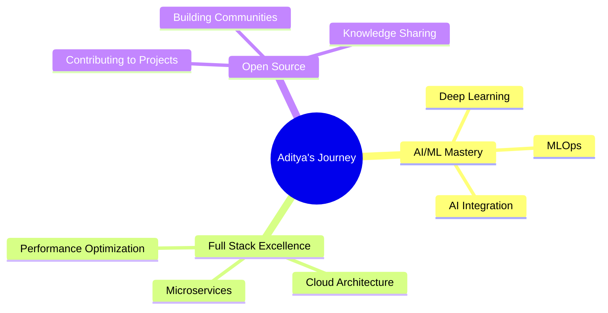

# Hi there, I'm Aditya Kotnala! 👋

<div align="center">
  
</div>

<div align="center">
  
</div>

## 🌟 About Me

> Passionate **Full Stack Developer** from Delhi, India 🇮🇳, specializing in **AI-powered web solutions** and modern development practices.

```javascript
const aditya = {
    location: "Delhi, India 🏛️",
    currentFocus: ["AI Integration", "Full Stack Development", "Modern Web Apps"],
    learning: ["Advanced AI/ML", "Cloud Architecture", "DevOps"],
    askMeAbout: ["React", "Node.js", "Python", "AI/ML", "System Design"],
    funFact: "I turn coffee into code and ideas into reality! ☕→💻"
};
```

## 💼 Professional Journey

### 🔥 Current Role
**Java Web Development with AI Trainee** at HCLTech *(Dec 2024 - Mar 2025)*
- 🚀 Mastering enterprise-level Java development and AI integration
- 🎯 Building scalable web applications with modern frameworks

### 🌟 Recent Experience
- **Full Stack Developer Intern** @ Opalina Technologies *(May - Aug 2025)*
- **Full Stack Developer Intern** @ Trihari Smart Solutions *(Jul - Aug 2025)*

## 🛠️ Tech Arsenal

<div align="center">
  
### 💻 Languages & Frameworks


### 🎨 Frontend Magic


### ⚡ Backend Power


### 🗄️ Database & Tools


</div>

## 🚀 Featured Projects

<div align="center">
  
### 🏆 Synora - HackArena 2025 Winner
> **AI-powered community platform for student-mentor interactions**
- 🤖 Real-time collaboration with secure database integration
- 🎯 Built for seamless student-mentor tracking and participation
- 🔧 **Tech**: React, Node.js, MongoDB, Socket.io

---

### 📄 RAG Application - Document Intelligence
> **Advanced PDF processing with AI-powered semantic search**
- 📊 Full-stack RAG implementation with HeartAPI & Vector DB
- 🔍 Intelligent document-aware chatbot interactions
- 🔧 **Tech**: Python, FastAPI, Vector Database, NLP

---

### 🚗 Uber-Clone - Full Stack Application
> **Complete ride-hailing solution with real-time features**
- 🗺️ Live tracking via Socket.io and Google Maps API
- 🔐 Secure JWT authentication with bcrypt
- 🔧 **Tech**: React, Node.js, Express, MongoDB

</div>

## 📊 GitHub Analytics

<div align="center">
  
  
</div>

<div align="center">
  
</div>

<div align="center">
  
</div>

## 🎯 Current Goals & Learning

<div align="center">
  


</div>

- 🔭 Currently working on **AI-powered web applications**
- 🌱 Learning **Advanced AI/ML algorithms and cloud architecture**
- 👯 Looking to collaborate on **innovative full-stack projects**
- 💬 Ask me about **React, Node.js, Python, AI integration**
- ⚡ Fun fact: **I believe every problem has an elegant solution!**

## 🌐 Let's Connect!

<div align="center">
  
[](mailto:adityakotnala6@gmail.com)
[](tel:+919560214885)
[](https://linkedin.com/in/adityakotnala)

</div>

---

<div align="center">
  
### 💡 "Code is like humor. When you have to explain it, it's bad." - Cory House


**Thanks for visiting! Let's build something amazing together! 🚀**

</div>

---

<div align="center">
  
</div>
