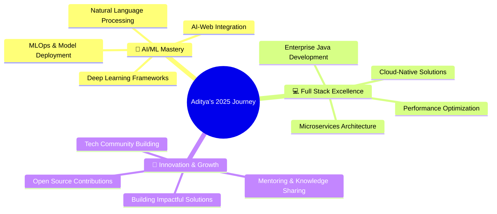

# Hi there, I'm Aditya Kotnala! 👋

  

  

## 🌟 About Me

  

<table align="center" style="border: none;">
<tr>
<td style="border: none; vertical-align: top; padding: 20px;">

🚀 **Passionate Full Stack Developer** from Delhi, India 🇮🇳  
💡 Specializing in **AI-powered web solutions** and cutting-edge technology  
🎯 Currently mastering **Java Web Development with AI** at **HCLTech**  
⚡ **Mission**: Bridging the gap between AI and Web Development  

</td>
</tr>
</table>

  

## 🛠️ Tech Arsenal

  
### 💻 Languages & Frameworks

### 🎨 Frontend Magic

### ⚡ Backend Power

### 🗄️ Database & Tools

## 📊 GitHub Analytics & Activity

  

  
  

  

  

  

## 🎯 Current Goals & Learning

  

  

```mermaid
mindmap
  root((Aditya's 2025 Journey))
    🤖 AI/ML Mastery
      Deep Learning Frameworks
      MLOps & Model Deployment
      AI-Web Integration
      Natural Language Processing
    💻 Full Stack Excellence
      Enterprise Java Development
      Microservices Architecture
      Cloud-Native Solutions
      Performance Optimization
    🌟 Innovation & Growth
      Open Source Contributions
      Tech Community Building
      Mentoring & Knowledge Sharing
      Building Impactful Solutions
```

### 🚀 What I'm Up To

| 🔭 **Currently Working On** | 🌱 **Learning** | 👯 **Looking to Collaborate** |
|:--:|:--:|:--:|
| AI-Powered Web Applications | Advanced AI/ML Algorithms | Innovative Full-Stack Projects |
| Enterprise Java Projects | Cloud Architecture & DevOps | Open Source Contributions |
| Modern Web Solutions | System Design Patterns | AI Integration Projects |

- 💡 **Passionate about**: Creating solutions that make a difference
- 🎯 **2025 Goals**: Master AI integration in web development
- ⚡ **Fun fact**: I believe every bug is just a feature waiting to be discovered! 🐛➡️✨
- 🏆 **Philosophy**: Code with passion, innovate with purpose!

## 🌐 Let's Connect & Collaborate!

  

---

  
### 💡 "The best way to predict the future is to create it." - Peter Drucker

### 🚀 Ready to collaborate? Let's build something extraordinary together! 

  

**Thanks for visiting! Let's innovate together! 🌟**

---

  

